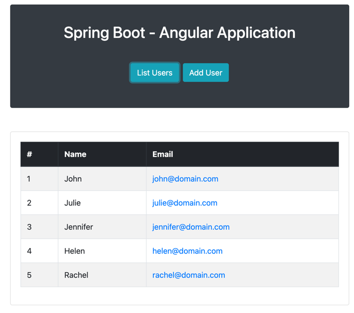

# JeKa Springboot-Angular application

This repo show-cases how to build a Springboot+Angular Application with JeKa. The build involves :

- Compilation + testing of the Java code
- Compilation + testing of the Angular code
- Sonarqube + Test coverage analysis of Java code
- Sonarqube + Test coverage analysis of Angular code
- End-to-end testing (using selenide) on application deployed on host
- End-to-end testing (using selenide) on application deployed on Docker

Additionally this demo showcases [how to create Docker native images](#Docker-Image).

The application is a simple web app, managing a list of users.



It has been copied from Tutorial https://www.baeldung.com/spring-boot-angular-web

## Run the application

> [!NOTE]
> Here, we assume that users clone the repository prior using JeKa commands.
> Therefore, JeKa installation on host is not mandatory, as the repo includes shell scripts (*jeka* and *jeka.ps1*) at its root.

Clone this repository, and execute the following command from the root dir :

```shell
jeka -p
```
This creates a bootable jar if absent, then launch it.
Tha application is usable at http://localhost:8080

On second run, the app is directly executed, bypassing the build phase.

> [!TIP]
> If you want to start the application without cloning Git repository by yourself, just execute :
> 
> `jeka -r https://github.com/jeka-dev/demo-project-springboot-angular.git -p`


## Build application

To build application, including both Java and Angular testing, execute :
```shell
jeka project: pack
```
This creates a bootable jar in *jeka-output* dir. 

The bootable jar embeds the Angular application.
This is because `NodeJs` Kbean is configured to build Angular app alongside Springboot app 
(`@nodeJs.autoConfigureProject=true` in  [jeka.properties](jeka.properties)).

## Build application with sonar analysis + code coverage

> [!NOTE]
> You need a sonarqube server to execute this.
> 
> By default, the server is expected to be found at *http://localhost:9000*.
> 
> You can launch a Sonarqube instance using docker `docker run -p 9000:9000 -d sonarqube:latest`. Then :
>    - Go to http;//localhost:9000
>    - login with 'admin/admin'
>    - Go Administration > Security > User > Tokens > add ..
>    - Copy the token and add a property 'sonar.token=[TOKEN]' in *[USER HOME]/.jeka/global.properties* file


```shell
jeka ::packQuality
```
The meaning of *::packQuality* and the tool versions are defined in [jeka.properties](jeka.properties)

The Sonarqube analysis + coverage for Java code is provided out-of-the-box, thanks to *Jacoco* and *Sonarqube* Kbean, 
that are activated in the command line.

For Angular part, a specific method `sonarJs` has been implemented. 
This method invoke is defined in the `::packQuality` shorthand.

## End-to-end testing

Here, the application is tested end-to-end using [selenide](https://https://selenide.org/).

This allows to test the application by simulating user actions on the browser.

The test classes for e2e tests are located in *e2e* package from *test* dir.

The tests are executed on deployed applications. This build includes 2 scenarios :

- Testing the application deployed on local host
- Testing the application deployed as docker container

### Testing on local host

Make sure the application is already build (`jeka project: pack`).

```shell
jeka e2e
```
This will :
- launch the application on local host
- Wait that the application is ready
- Execute the e2e test suite against the locally deployed application
- Shutdown the application when test are finished

This execution workflow is defined in `e2e()` method from `Build` class in *jeka-src* dir.

### Testing with Docker

> [!NOTE]
> This requires to have a Docker client running. This can be *DockerDesktop* running on your laptop.

Make sure that the docker image is already built.
```shell
jeka docker: build
```
This constructs a Docker image of the application. 
he specific setup of the image is defined in `Build#customizeDockerImage` method.

You can execute directly the image by executing:
```shell
docker run --rm -p 8080:8080 demo-project-springboot-angular:latest
```

```shell
jeka e2eDocker
```
This will :
- launch the application in a container
- Wait that the application is ready
- Execute the e2e test suite against the containerized app
- Shutdown and remove the container

This execution workflow is defined in `Build.e2eDocker()` method.

## Create native executable and Docker native image

Compile the Spring-Boot project in a native executable:
```shell
jeka native: compile
```
The *springboot KBean* (declared in *jeka.properties*) instructs the *native KBean* to include a Spring AOT enrichment phase prior executing *native-image*.
Thus, no additional configuration is needed.

### Docker Image

With Jeka, you can easily create Docker native images, regardless of whether you're running on Windows, Linux, or macOS.

To create a Docker image, run: 
```shell
jeka docker: buildNative
```

By default, the native image is based on Ubuntu. 

We can generate a smaller image, based on a minimal distroless image, but we need to
compile by statically linking *libc*, as it is not included in that image.

```shell
jeka native: staticLink=MUSL docker: nativeBaseImage=gcr.io/distroless/static-debian12:nonroot buildNative
```

To see details of the generated image, use `docker: infoNative` command, as :
```shell
jeka docker: nativeBaseImage=gcr.io/distroless/static-debian12:nonroot infoNative
```

You can also inspect the generated (Docker build dir)[jeka-output/docker-build-native-demo-project-springboot-angular#latest]

To shorten command line, some parameters can be mentioned in *jeka.properties* file.
```properties
@native.staticLink=MUSL
@docker.nativeBaseImage=gcr.io/distroless/static-debian12:nonroot
@springboot.aotProfiles=my-profile-a,my-profile-b
```

The generated Dockerbuild file can be customized using code following in the init method of your KBean :

```java
@Override
public void init() {
    ...
    load(DockerKBean.class).customizeNativeImage(steps -> steps
            .addCopy(aFile, "/etc/myconfig")
            .add("RUN ..."))
    ;
}
```


